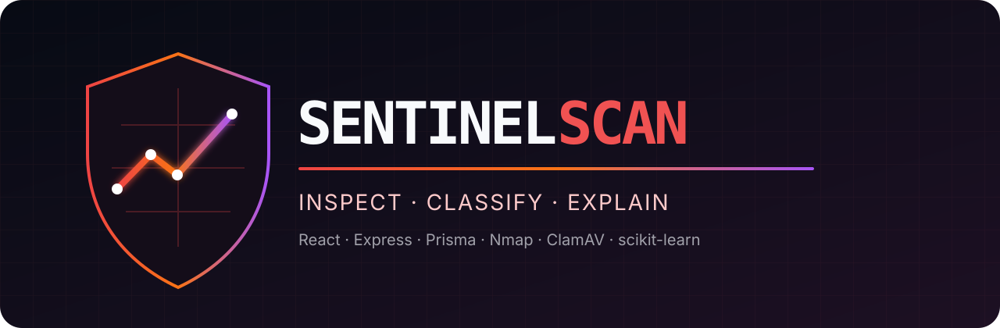
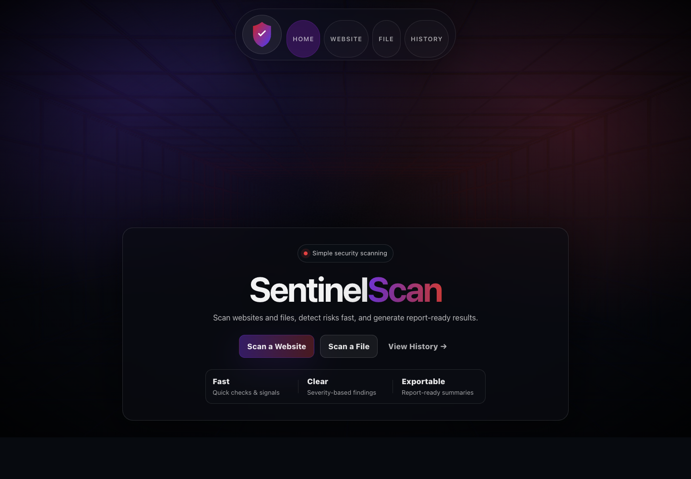
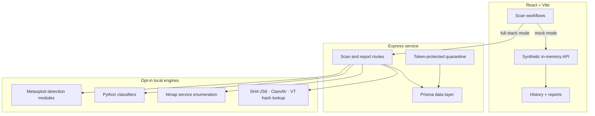

<div align="center">
  

  <h3>Security engineering by <a href="https://github.com/Gix13">Gio Abou Sleiman</a>, with the SentinelScan project team</h3>

  <p><strong>An educational full-stack security platform for file triage and authorized website assessment.</strong></p>

  [](https://github.com/Gix13/sentinelscan/actions/workflows/ci.yml)
  
  
  
  
  [](LICENSE)

  **[Explore the safe live demo](https://sentinelscan-demo.vercel.app)**
</div>

## Overview

SentinelScan explores how a modern interface can turn heterogeneous security signals into understandable reports. It combines a React/Vite client, an Express API, Prisma/SQLite persistence, opt-in local security tools, and two reproducible machine-learning pipelines.

The safest way to explore the project is its frontend-only demonstration mode: every result is synthetic, kept in memory, and requires no target, uploaded sample, credential, or backend. Full-stack integrations are deliberately disabled until an operator enables them in a controlled environment.

<div align="center">
  
  <br>
  <sub>Mock-mode dashboard with no live target or assessment data.</sub>
</div>

> [!IMPORTANT]
> SentinelScan is an educational final-year project, not a production malware sandbox, a hosted public scanner, or a substitute for professional validation. Network features may be used only on systems covered by explicit authorization.

## What it demonstrates

- File intake with size/type validation, SHA-256 hashing, organized storage, and quarantine controls
- Optional ClamAV scanning and hash-only VirusTotal lookup
- URL validation and opt-in Nmap service enumeration with private-range blocking
- Background scan jobs, persistent reports, findings, and paginated history
- Optional phishing-URL and network-attack classification pipelines
- Token-protected quarantine administration with header-only credentials
- Interactive React 19 interface with a custom Three.js/WebGL scan field
- Synthetic mock mode for a safe, zero-infrastructure portfolio demonstration

## System architecture



## Two ways to run it

| Mode | Best for | Data used | External tools |
| --- | --- | --- | --- |
| Frontend mock | Portfolio review and UI exploration | Synthetic, in-memory results | None |
| Local full stack | Controlled integration testing | Operator-supplied local inputs | SQLite; scanners only when explicitly enabled |

## Repository layout

```text
apps/
├── frontend/    React 19, Vite, Three.js, GSAP, report UI, mock API
├── backend/     Express 5, Prisma/SQLite, scan routes, storage, quarantine
└── ml/          Feature extraction, training, inference, evaluation
```

## Safe frontend demonstration

Requirements: Node.js 20+ and npm.

```bash
git clone https://github.com/Gix13/sentinelscan.git
cd sentinelscan/apps/frontend
cp .env.example .env
npm ci
npm run dev
```

The example configuration sets `VITE_USE_MOCK_API=true`. Website and file actions generate synthetic reports in memory; refreshing the page clears them.

## Local full-stack setup

### 1. Backend

```bash
cd apps/backend
cp .env.example .env
```

Replace `ADMIN_TOKEN` with a new random value. Keep every scanner disabled for the first start:

```bash
npm ci
npx prisma generate
npx prisma db push
npm run dev
```

The API listens on `http://localhost:5000` by default. Verify it with:

```bash
curl http://localhost:5000/health
```

### 2. Frontend

In another terminal:

```bash
cd apps/frontend
cp .env.example .env
```

Set `VITE_USE_MOCK_API=false`, then run:

```bash
npm ci
npm run dev
```

## Optional security engines

All active integrations are opt-in through `apps/backend/.env`.

| Setting | Integration | Operational note |
| --- | --- | --- |
| `ENABLE_NMAP=true` | Nmap service enumeration | Requires Nmap and explicit authorization for the target |
| `ENABLE_CLAMSCAN=true` | Local ClamAV scan | Requires ClamAV and current signatures |
| `VIRUSTOTAL_API_KEY=...` | VirusTotal hash lookup | Hash-only lookup; subject to the configured API plan |
| `ENABLE_PHISHING_ML=true` | URL classifier | Requires a locally trained trusted model |
| `ENABLE_NETWORK_ML=true` | Network classifier | Experimental mapping from port signals to NSL-KDD features |
| `ENABLE_METASPLOIT=true` | Detection-only modules | Controlled environments only; disabled by default |

Never put `ADMIN_TOKEN` or `VIRUSTOTAL_API_KEY` in the frontend. Admin authentication is accepted only through the `x-admin-token` header so tokens do not leak through URLs or routine access logs.

## Reproducing the ML pipelines

Datasets and serialized models are excluded. This avoids redistributing third-party data and prevents opaque Pickle/Joblib objects from entering the repository.

```bash
cd apps/ml
python3 -m venv venv
source venv/bin/activate
python -m pip install --upgrade pip
python -m pip install -r requirements.txt
```

Follow [`apps/ml/data/README.md`](apps/ml/data/README.md), then run:

```bash
python train_phishing.py
python evaluate_phishing.py
python train_network.py
python evaluate_network.py
```

Only load model artifacts you created or independently trust. Pickle-compatible formats such as Joblib can execute code during deserialization.

### Research limitation

The network pipeline is experimental. NSL-KDD describes complete network connections, while Nmap provides only a small set of port- and service-level observations. Features that cannot be observed are filled with documented defaults; consequently, its output is an educational indicator, not a defensible host-risk verdict.

## API outline

| Method | Path | Purpose |
| --- | --- | --- |
| `GET` | `/health` | Service and database health |
| `POST` | `/api/scan/file` | Validate, hash, and inspect a local upload |
| `POST` | `/api/scan/website` | Queue an authorized website assessment |
| `GET` | `/api/history` | Paginated scan history |
| `GET` | `/api/report/:id` | Structured report and findings |
| `GET/POST/DELETE` | `/api/admin/quarantine/...` | Header-authenticated quarantine controls |

## Docker

The backend image starts with every active scanner disabled and contains no datasets or trained models.

```bash
docker build -f apps/backend/Dockerfile -t sentinelscan-backend .
docker run --rm -p 5001:5001 \
  -e ADMIN_TOKEN='replace-with-a-long-random-value' \
  -e CORS_ORIGIN='http://localhost:5173' \
  sentinelscan-backend
```

For any environment beyond a local lab, add authentication for scan routes, rate limiting, persistent encrypted storage, an explicit CORS allowlist, resource limits, and a dedicated sandbox for untrusted files. Do not expose this educational service directly to the public internet.

## Security and privacy model

- Active scanners are disabled by default.
- Mock mode uses no real files or targets and stores nothing persistently.
- Private, loopback, and link-local Nmap destinations are rejected.
- Uploaded filenames are normalized before filesystem storage.
- Credentials belong in ignored backend environment files or a secret manager.
- Databases, uploads, quarantine content, models, datasets, and captures are ignored by Git.
- Automated findings require manual validation before reporting.

See [SECURITY.md](SECURITY.md) for repository vulnerability reports.

## Verification status

CI installs from lockfiles, audits production dependency trees, runs backend safety tests, validates Prisma, lints and builds the frontend, and performs Python syntax/feature-extractor smoke checks. CI does not scan targets, upload samples, call VirusTotal, or execute ClamAV, Nmap, Metasploit, or trained models.

## Project provenance and attribution

SentinelScan was developed as a team final-year computer science project at the American University of Beirut. Gio Abou Sleiman contributed across the full-stack architecture, ML pipeline, and frontend. This repository must retain team-project attribution and must not imply sole authorship.

The publication copy intentionally excludes credentials, targets, uploaded files, scan history, local databases, training data, trained models, screenshots containing assessment data, and deployment-specific secrets.
